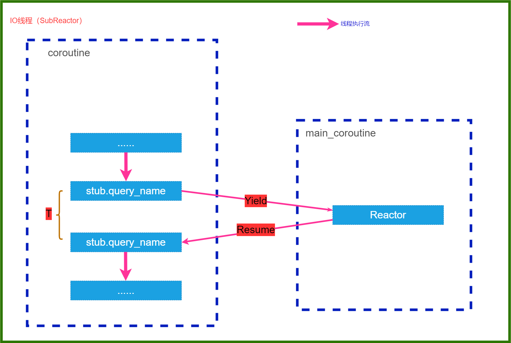
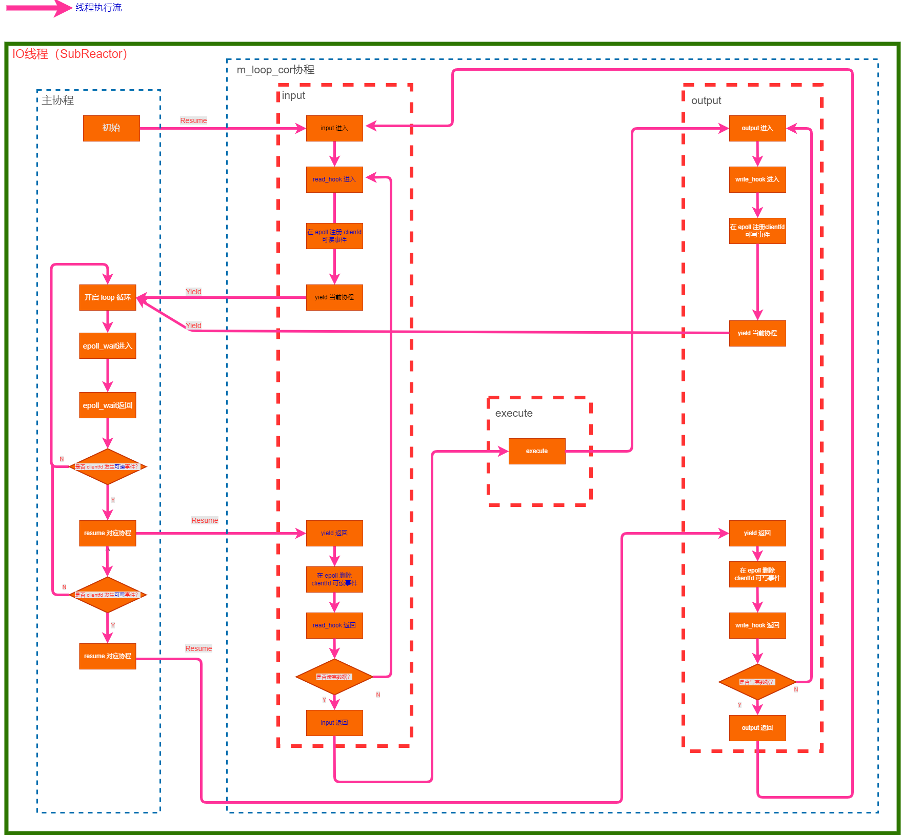

# TinyRPC

        


作者：**ikerli**  **2022-05-13**
**使用 TinyRPC, 轻松地构建高性能 RPC 服务！**


## 1. 简介
### 1.1 TinyRPC 特点
**TinyRPC** 是一款基于 **C++11** 标准开发的小型**异步 RPC** 框架。TinyRPC 的核心代码应该也就几千行样子，尽量保持了简洁且较高的易读性。

麻雀虽小五脏俱全，从命名上就能看出来，TinyRPC 框架主要用义是为了让读者能**快速地**、**轻量化**地搭建出具有较高性能的异步RPC 服务。至少用 TinyRPC 搭建的 RPC 服务能应付目前大多数场景了。

**TinyRPC** 没有实现跨平台，只支持 Linux 系统，并且必须是 64 位的系统，因为协程切换只实现了 **64** 位系统的代码，而没有兼容 **32** 位系统。这是有意的，因为作者只会 Linux 下开发，没能力做到跨平台。


**TinyRPC** 的核心思想有两个：
1. 让搭建高性能 RPC 服务变得简单
2. 让异步调用 RPC 变得简单

必须说明的是， **TinyRPC** 代码没有达到工业强度，最好不要直接用到生产环境，也可能存在一些未知 BUG，甚至 coredump。读者请自行辨别，谨慎使用！


### 1.2 TinyRPC 支持的协议报文
**TinyRPC** 框架目前支持两类协议：
1. 纯 **HTTP** 协议: TinyRPC 实现了简单的很基本的 HTTP(1.1) 协议的编、解码，完全可以使用 HTTP 协议搭建一个 RPC 服务。
2. TinyPB 协议: 一种基于 **Protobuf** 的自定义协议，属于二进制协议。更多内容参考： [TinyPB协议详解](./tinypb_protocal.md)

### 1.3 TinyRPC 的 RPC 调用
TinyRPC 是一款异步的 RPC 框架，这就意味着服务之前的调用是非常高效的。目前来说，TinyRPC 支持两种 RPC 调用方式：**阻塞式异步调用** 和 **future 式异步调用**。

#### 1.3.1 阻塞协程式异步调用

阻塞协程式异步调用这个名字看上去很奇怪，阻塞像是很低效的做法。然而其实他是非常高效的。他的思想是**用同步的代码，实现异步的性能。** 也就是说，**TinyRPC** 在 RPC 调用时候不需要像其他异步操作一样需要写复杂的回调函数，只需要直接调用即可。这看上去是同步的过程，实际上由于内部的协程封装实现了完全的异步。而作为外层的使用者完全不必关系这些琐碎的细节。

阻塞协程式异步调用对应与 TinyPbRpcChannel 类，一个简单的调用例子如下：

```c++
tinyrpc::TinyPbRpcChannel channel(std::make_shared<tinyrpc::IPAddress>("127.0.0.1", 39999));
QueryService_Stub stub(&channel);

tinyrpc::TinyPbRpcController rpc_controller;
rpc_controller.SetTimeout(10000);

DebugLog << "RootHttpServlet begin to call RPC" << count;
stub.query_name(&rpc_controller, &rpc_req, &rpc_res, NULL);
DebugLog << "RootHttpServlet end to call RPC" << count;
```

这看上去跟普通的阻塞式调用没什么区别，然而实际上在 stub.query_name 这一行是完全异步的，简单来说。线程不会阻塞在这一行，而会转而去处理其他协程，只有当数据返回就绪时，query_name 函数自动返回，继续下面的操作。
这个过程的执行流如图所示：



从图中可以看出，在调用 query_name 到 query_name 返回这段时间 T，CPU 的执行权已经完全移交给主协程了，也就说是这段时间主协程可以用来做任何事情：包括响应客户端请求、执行定时任务、陷入 epoll_wait 等待事件就绪等。对单个协程来说，它的执行流被阻塞了。但对于整个线程来说是完全没有被阻塞，它始终在执行着任务。

另外这个过程完全没有注册回调函数、另起线程之类的操作，可它确确实实达到异步了。这也是 **TinyRPC** 的核心思想之一。

这种调用方式是 TinyRPC 推荐的方式，它的优点如下：
1. 代码实现很简单，直接同步式调用，不需要写回调函数。
2. 对IO线程数没有限制，**即使只有 1 个 IO 线程**，仍然能达到这种效果。
3. 对于线程来说，他是**不会阻塞线程**的。

当然，它的缺点也存在：
1. RPC 调用必须写在一个协程里面。
2. 对于**当前协程来说，他是阻塞的**，必须等待协程再次被唤醒（**RESUME**）才能执行下面的代码。


#### 1.3.2 future 式异步调用
**Future 式异步调用**是另一种 RPC 调用方式，它解决了**阻塞协程式异步调用** 的一些缺点，当然也同时引入了一些限制。这种方式使用到了 C++11 的 future 特性和 promise 特性，更多内容请参考 **CPPREFRENCE**.

future 式异步调用对应 TinyPbRpcAsyncChannel，一个简单调用例子如下：

```c++
tinyrpc::TinyPbRpcAsyncChannel::ptr async_channel = std::make_shared<tinyrpc::TinyPbRpcAsyncChannel>(std::make_shared<tinyrpc::IPAddress>("127.0.0.1", 39999));
QueryService_Stub stub(async_channel.get());

tinyrpc::TinyPbRpcController rpc_controller;
rpc_controller.SetTimeout(2000);

AppDebugLog << "AsyncRPCTestServlet begin to call RPC async";
stub.query_age(&rpc_controller, &rpc_req, &rpc_res, NULL);
AppDebugLog << "AsyncRPCTestServlet async end, now you can to some another thing";

AppDebugLog << "AsyncRPCTestServlet test sleep 2 s when call async rpc back, now to call future.wait()";

async_channel->getFuture().wait();
AppDebugLog << "future.wait() back, now to check is rpc call succ";

```

注意在这种调用方式中，query_age 会立马返回，协程可以继续执行下面的代码。但这并不代表着调用 RPC 完成，如果你需要获取调用结果，请使用:
```c++
async_channel->getFuture().wait();
```
这一行代码会一直阻塞知道 RPC 调用完成，更新 future 的值后, 并且这一行操作会阻塞线程(注意是线程不是协程)。因此，如非必要，请尽量少使用 wait().

这种调用方式的原理很简单，当前IO线程 A 会把这个调用任务交给另外一个 IO 线程B来完成，同时返回给调用方一个 future 对象, 调用方使用 future 对象即可获取调用结果。

IO线程B会在适当的时候完成这个调用,实际上对于 线程B来说，它等同于在内部做了一次 **阻塞协程式异步调用**。

总之，future 异步调用的优点如下：
1. **不阻塞当前协程**(前提是不调用 future.wait() 等获取调用结果)

而缺点如下：
1. 调用 future.wait()、future.get()等 会直接阻塞整个线程(当然整个线程的所有协程也被阻塞了)，不推荐这种做法。
2. IO 线程数至少是 2 才能达到这种调用，因为需要把调用任务交给另一个线程来做。


## 2. 安装 TinyRPC
### 2.1 安装必要的依赖库
要正确编译 **TinyRPC**, 至少要先安装这几个库：

#### 2.1.1 protobuf
**protobuf** 是 **google** 开源的有名的序列化库。谷歌出品，必属精品！**TinyRPC** 的 **TinyPB** 协议是基于 protobuf 来 序列化/反序列化 的，因此这个库是必须的。
其地址为：https://github.com/protocolbuffers/protobuf
安装过程不再赘述。

#### 2.1.2 tinyxml
由于 **TinyRPC** 读取配置使用了 **xml** 文件，因此需要安装 **tinyxml** 库来解析配置文件。
其地址为: https://github.com/leethomason/tinyxml2

### 2.2 选装插件库
有些库不是那么容易安装，为了不妨碍核心功能的实现，我把这些库都作为插件来编译了。
这些插件库不是强依赖的，因为它不属于 TinyRPC 服务的核心功能，只能算是功能上的锦上添花。为了不影响基础库的编译， TinyRPC 把这些库作为插件来加载，通过宏定义来控制编译。

**需要说明的是：即使你不安装这些插件库， TinyRPC 依然能正常编译，它的核心基础功能是完全具备的。**

#### 2.2.1 libmysqlclient
TinyRPC 简单封装了下 MySQL 的调用，因为 MySQL 确实在 RPC 服务中用的比较多了。
需要安装 **MySQL** 的 glibc 库，用于 MySQL 操作, 选择所需的版本安装即可(建议 5.7 以上)

官方下载地址：https://downloads.mysql.com/archives/community/

注意，以上几个库的头文件我都放在了 **/usr/include** 下， 库文件放在了 **/usr/lib** 下。因此在 [makefile](./makefile) 中并没有指定其头文件和库文件路径，因为其被安装在了系统默认搜索路径中，无需特殊指定。

另外，额外需要修改下 [makefile](./makefile) 文件才能支持插件的编译，否则默认的编译是不会包含这些插件功能的。

修改也很简单，如下即可：
```makefile
1. 添加宏定义 -D DECLARE_MYSQL_PLUGIN, 表示需要编译 MySQL 插件

# CXXFLAGS += -g -O0 -std=c++11 -Wall -Wno-deprecated -Wno-unused-but-set-variable
CXXFLAGS += -g -O0 -std=c++11 -Wall -Wno-deprecated -Wno-unused-but-set-variable -D DECLARE_MYSQL_PLUGIN


2. 添加库文件路径

MYSQL_LIB = /usr/lib/libmysqlclient.a
PLUGIN_LIB = $(MYSQL_LIB)

```


### 2.3 安装和卸载

#### 2.3.1 安装 TinyRPC
在安装了前置的几个库之后，就可以开始编译和安装 **TinyRPC** 了。安装过程十分简单，只要不出什么意外就好了。

**祈祷**一下一次性成功，然后直接执行以下几个命令即可：
```
git clone https://github.com/Gooddbird/tinyrpc

cd tinyrpc

mkdir bin && mkdir lib

// 生成测试pb桩文件
cd testcases
protoc --cpp_out=./ tinypb.proto

cd ..
// 先执行编译
make -j4

// 编译成功后直接安装就行了
make install
```

注意, make install 完成后，默认会在 **/usr/lib** 路径下安装 **libtinyrpc.a** 静态库文件，以及在 **/usr/include/tinyrpc** 下安装所有的头文件。

如果编译出现问题，欢迎提 [issue](https://github.com/Gooddbird/tinyrpc/issues/), 我会尽快回应。

#### 2.3.2 卸载 TinyRPC
卸载也很简单，如下即可：
```
make uninstall
```
**注：如果此前已经安装过 TinyRPC, 建议先执行卸载命令后再重新 make install 安装.**


## 3. 如何使用 TinyRPC

### 3.1 快速上手
在 make 成功之后，出了生成静态库文件。此外，还会在 bin 目录下生成一些单元测试文件。TinyRPC 提供了一个简单地 RPC 服务调用示例，更多内容请参考文档：[quick_stark](./quick_rpc_test.md).


### 3.2 标准示例

我将提供一个标准的 TinyRPC 框架开发的 RPC 服务案例，目前准备简单实现一个分布式的服务注册中心。不过这个工程的架构算是比较规范的了，可以参考下：
更多内容请移步项目(建设中)：[分布式服务中心 -- charon](https://github.com/Gooddbird/charon)


## 4. 模块设计
**TinyRPC** 框架的主要模块包括：异步日志、协程封装、Reactor封装、Tcp 封装、TinyPb协议封装、HTTP 协议封装、以及RPC封装模块等。

### 4.1 异步日志模块
设计初期，**TinyRPC** 的日志主要参考了 (**sylar**),并精简后实现了最基础的打印日志。

在开发到一定程度后，发现同步日志或多或少有些影响性能，毕竟每次写入文件的磁盘IO还是比较耗时的。遂改为异步日志。TinyRPC 的异步日志实现非常简单，只是额外启动了一个线程来负责打印日志罢了。

当然，**TinyRPC** 的日志做到了了以下几点：
- **异步日志**：日志异步打印，不阻塞当前线程。生产者只需要将日志信息放入buffer即可，消费者线程会按照一定时间频率自动将日志同步到磁盘文件中。
- **日志级别**：日志分级别打印，**当设定级别高于待打印日志的级别时，日志打印是个空操作**，无性能消耗。
- **文件输出**：日志支持可以输出到文件中，特别是在生产环境上，把日志打印到控制台可不是一个好方法。
- **滚动日志**：日志文件会自行滚动，当**跨天**或者**单个文件超过一定大小**后，会自动建立新的文件写入日志信息。
- **崩溃处理**：TinyRPC 的日志库处理了**程序突然崩溃**的情况，简单来说就是当程序崩溃退出前先将日志信息同步到磁盘文件上。这是非常重要的，如果缺失了崩溃那一瞬间的日志内容，那就很难排查具体原因。
- **日志分类**：TinyRPC 提供了两类日志类型，**RPC 框架日志**以及 **APP 应用日志**。RPC 框架日志以 rpc 后缀结尾，是 TinyRPC 框架在运行中打印的日志信息，通常用来监控框架本身的运行状态。APP 应用日志以 **app** 后缀结尾 专门用来处理用户请求，对于每一个客户端请求，APP 日志会打印出请求的 msg 作为标识。总的来说，如果你只是使用 TinyRPC，关注APP日志即可。

你可以分别使用宏定义 **DebugLog** 和 **AppDebugLog** 打印这两种日志:
```
DebugLog << "11";
AppDebugLog << "11";
```

### 4.2 协程模块
TinyRPC 的协程底层使用了腾讯的开源协程库 [libco](https://github.com/Tencent/libco)，即协程上下文切换那一块。而协程切换的原理不过是寄存器切换罢了。
除了协程切换之外，TinyRPC 提供了一些基本函数的 hook，如 read、write、connect 等函数。

更多协程的介绍请移步我的知乎文章：

[C++实现的协程网络库tinyrpc（一）-- 协程封装](https://zhuanlan.zhihu.com/p/466349082)

[C++实现的协程网络库tinyrpc（二）-- 协程Hook](https://zhuanlan.zhihu.com/p/474353906)

[协程篇（一）-- 函数调用栈](https://zhuanlan.zhihu.com/p/462968883)


### 4.3 Reactor 模块
可移步知乎文章：

[C++实现的协程网络库tinyrpc（四）-- Reactor 实现](https://zhuanlan.zhihu.com/p/503323714)

[Reactor模式介绍](https://zhuanlan.zhihu.com/p/428693405)

### 4.4 Tcp 模块

#### 4.4.1 TcpServer
TcpServer 的运行逻辑如下：


原理可参考文章：
[C++实现的协程异步 RPC 框架 TinyRPC（五）-- TcpServer 实现](https://zhuanlan.zhihu.com/p/523947909)


#### 4.4.2 TcpConnection

TcpConnection 运行逻辑如下：




原理可参考文章：
[C++实现的协程异步 RPC 框架 TinyRPC（六）-- TcpConnection 实现](https://zhuanlan.zhihu.com/p/524517895)


### 4.5 TinyPB 协议
TinyPB 是 TinyRPC 框架自定义得一种协议类型，它基于 google 的 protobuf 而定制的，协议更多细节见 [TinyPb协议详解](./tinypb_protocal.md).

### 4.6 Http 模块
TinyRPC 的 HTTP 模块实际上有点模仿 Java 的 Servlet 概念，每来一个 HTTP 请求就会找到对应的 HttpServlet 对象，执行其提前注册好的业务逻辑函数，用于处理 Http 请求，并回执 Http 响应。

### 4.7 RPC 调用封装
--建设中，敬请期待--


## 关于作者
**ikerli**
Linux 后台开发、分布式系统、C++  持续学习中！

联系我：**1753009868@qq.com**

欢迎关注我的**知乎**账号：知乎搜索 **ikerli**

欢迎关注我的**个人微信**公众号, **微信公众号** 搜索 **ikerli**(无广告，放心食用):


## 参考资料
libco: https://github.com/Tencent/libco

sylar: https://github.com/sylar-yin/sylar

muduo: https://github.com/chenshuo/muduo

tinyxml: https://github.com/leethomason/tinyxml2

protobuf: https://github.com/protocolbuffers/protobuf